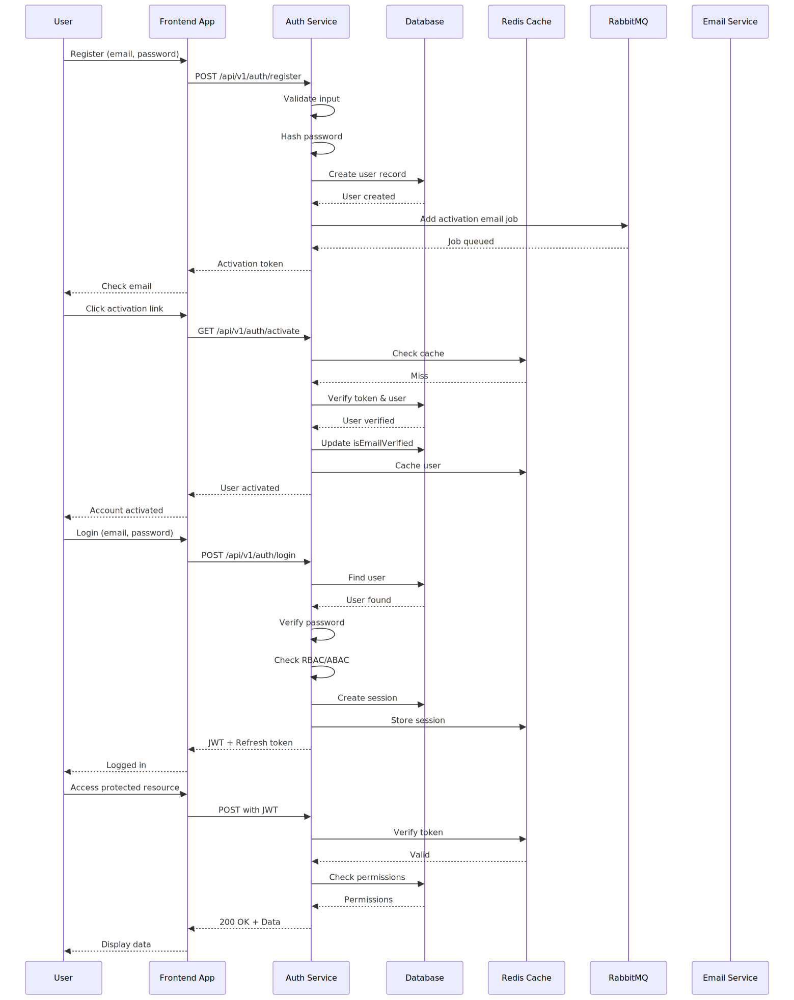
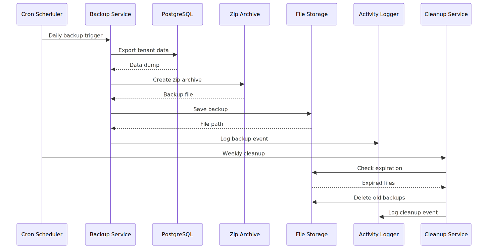

# Express Boilerplate

A production-ready Express.js boilerplate with PostgreSQL/MySQL support, JWT authentication, role-based access control (RBAC), attribute-based access control (ABAC), and multi-layered rate limiting.

## Features

- **Framework**: Express.js v5
- **Database**: PostgreSQL or MySQL (via Sequelize ORM)
- **Authentication**: JWT with access and refresh tokens
- **Authorization**: RBAC + ABAC with 3 role levels
- **Multi-Tenancy**: Full tenant isolation with identification, scoping, and feature flags
- **Rate Limiting**: Token-based multi-layer rate limiter (in-memory + Redis)
- **Caching**: Redis-based caching for frequently accessed data
- **Message Queue**: Redis-based async email queue for non-blocking operations
- **Distributed Locks**: Redis-based distributed locking to prevent race conditions
- **API Documentation**: Swagger/OpenAPI
- **Logging**: Winston with daily rotate files
- **Security**: Helmet, CORS, HPP, input sanitization
- **Backups**: Automated cron-based backups with zip compression
- **Session Management**: Automatic expired session cleanup with configurable cron schedule
- **File Uploads**: Tenant logo and user avatar upload with delete functionality
- **Audit Logging**: Comprehensive tenant activity tracking
- **Feature Flags**: Per-tenant feature management
- **Tenant Backup & Restore**: Create, download, and restore tenant data backups

## Project Structure

```
├── src/
│   ├── config/          # Database and app configuration
│   ├── controllers/     # Request handlers
│   ├── docs/            # Swagger documentation
│   ├── middlewares/     # Express middlewares
│   │   ├── tenantContext.js   # Tenant identification middleware
│   │   └── tenantScope.js     # Tenant scoping middleware
│   ├── models/          # Sequelize models
│   │   ├── tenant.js            # Tenant model
│   │   ├── tenant_role.js       # Tenant-specific roles
│   │   ├── tenant_feature.js    # Feature flags
│   │   └── tenant_audit_log.js  # Audit logging
│   ├── routes/          # API route definitions
│   ├── services/        # Business logic
│   │   ├── tenant.service.js        # Tenant CRUD
│   │   ├── tenantFeature.service.js # Feature flags
│   │   ├── tenantAudit.service.js   # Audit logging
│   │   ├── tenantOnboarding.service.js # Onboarding workflow
│   │   ├── redis.service.js         # Redis connection and caching
│   │   └── emailQueue.service.js    # Async email queue worker
│   ├── templates/       # Email templates
│   ├── utils/           # Utility functions
│   └── validators/      # Input validation schemas
├── uploads/             # User uploaded files
│   ├── tenant/          # Tenant logos
│   └── profile/         # User avatars
├── index.js             # Application entry point
├── package.json
├── jest.config.js       # Jest test configuration
└── swagger.json         # Generated Swagger spec
```

## Diagrams

The following diagrams illustrate the architecture and flow of this boilerplate:

### System Architecture



### Authentication Flow



### RBAC/ABAC Authorization



### Database Schema



### Middleware Pipeline



### API Endpoints



### Multi-Tenancy



### Backup & Logging



### Security Layers



### Project Structure


### Docker Architecture



### Interactive Documentation

For interactive HTML documentation with embedded diagrams, see:

- [HTML Documentation](docs/DOCUMENTATION.html)
- [Markdown Documentation](docs/DOCUMENTATION.md)

## Getting Started

### Prerequisites

- Node.js 18+
- PostgreSQL 14+ or MySQL 8+
- Redis 7+ (for caching, message queue, and distributed locks)
- npm or bun

### Installation

1. Clone the repository:

```bash
git clone https://github.com/zed378/boilerplate-pg-mysql.git
cd boilerplate-pg-mysql
```

2. Install dependencies:

```bash
npm install
```

3. Copy and configure environment variables:

```bash
cp local.env .env
```

4. Update `.env` with your configuration:

```env
# Server
NODE_ENV=development
PORT=3000

# Database
DB_HOST=localhost
DB_PORT=5432
DB_NAME=your_database
DB_USER=your_username
DB_PASS=your_password
DB_DIALECT=postgres  # or mysql

# Redis
REDIS_URL=redis://localhost:6379
REDIS_HOST=localhost
REDIS_PORT=6379

# JWT
JWT_ACCESS_SECRET=your-access-secret
JWT_REFRESH_SECRET=your-refresh-secret
JWT_ACCESS_EXPIRED=15m
JWT_REFRESH_EXPIRED=7d

# Email (Nodemailer)
EMAIL_HOST=smtp.gmail.com
EMAIL_PORT=587
EMAIL_USER=your-email@gmail.com
EMAIL_PASS=your-app-password

# CORS
CORS_ORIGIN=http://localhost:3000,http://localhost:5173
```

5. Start the development server:

```bash
npm run dev
```

6. Start the production server:

```bash
npm start
```

## Multi-Tenancy

This boilerplate provides comprehensive multi-tenant support with the following features:

### Tenant Identification

Tenants can be identified through multiple methods (in order of priority):

1. **Header**: `X-Tenant-Code` or `X-Tenant-ID`
2. **Subdomain**: `acme.api.example.com` → tenant with code `acme`
3. **Query Parameter**: `?tenantCode=acme` or `?tenantId=uuid`

### Tenant Scoping

All queries are automatically scoped to the current tenant, ensuring data isolation. Super admins can override scoping for cross-tenant operations.

### Tenant-Specific Roles

Each tenant can define custom roles with their own hierarchy levels:

```javascript
// Create tenant-specific roles
const { TenantRoles } = require("../models");

await TenantRoles.create({
  tenantId: "tenant-uuid",
  name: "Project Manager",
  level: 5,
  description: "Manages projects within tenant",
});
```

### Feature Flags

Enable/disable features per tenant with configuration:

```javascript
const {
  enableFeature,
  isFeatureEnabled,
} = require("../services/tenantFeature.service");

// Enable a feature for a tenant
await enableFeature({
  tenantId: "tenant-uuid",
  featureKey: "advanced_analytics",
  config: { maxProjects: 10 },
});

// Check if feature is enabled
const isEnabled = await isFeatureEnabled("tenant-uuid", "advanced_analytics");
```

**Available Features:**

| Feature Key          | Tier    | Description                            |
| -------------------- | ------- | -------------------------------------- |
| `advanced_analytics` | PREMIUM | Advanced analytics and reporting       |
| `sso`                | PREMIUM | Single Sign-On integration             |
| `api_access`         | FREE    | API access for programmatic operations |
| `custom_branding`    | PREMIUM | Custom domain and branding             |
| `audit_log`          | PREMIUM | Audit logging and compliance reports   |
| `webhooks`           | BETA    | Webhook integrations                   |
| `multi_tenant_roles` | FREE    | Custom role management                 |
| `data_export`        | PREMIUM | Data export in multiple formats        |
| `team_collaboration` | FREE    | Team collaboration features            |
| `two_factor_auth`    | FREE    | Two-factor authentication              |

### Audit Logging

Track all tenant activities for compliance:

```javascript
const { logUserAction, ACTIONS } = require("../services/tenantAudit.service");

// Log a user action
await logUserAction(req, ACTIONS.USER_CREATE, {
  resourceType: "User",
  resourceId: "user-123",
  context: { details: "New user created" },
});

// Get security events
const securityEvents = await getSecurityEvents(tenantId, 30);
```

### Tenant Onboarding

Automated onboarding workflow for new tenants:

```javascript
const { onboardTenant } = require("../services/tenantOnboarding.service");

const result = await onboardTenant({
  name: "Acme Corp",
  code: "acme",
  admin: {
    firstName: "Admin",
    lastName: "User",
    email: "admin@acme.com",
  },
  createDefaultRoles: true,
  enableDefaultFeatures: true,
});
```

### Tenant Backup & Restore

Create, download, and restore backups for tenant data:

```javascript
const {
  createBackup,
  restoreBackup,
  downloadBackup,
  deleteBackup,
  getBackupStats,
} = require("../services/tenantBackup.service");

// Create a backup
const backup = await createBackup({
  tenantId: "tenant-uuid",
  createdById: "user-uuid",
  name: "Pre-migration backup",
  description: "Backup before system migration",
  backupType: "FULL", // FULL, PARTIAL, USER_ONLY
  retentionDays: 90,
  tag: "pre-migration",
});

// Restore from backup
const result = await restoreBackup({
  backupId: "backup-uuid",
  restoredById: "user-uuid",
  mergeData: false, // or true to merge with existing data
});

// Get backup statistics
const stats = await getBackupStats("tenant-uuid");
// { totalBackups: 5, completedBackups: 4, failedBackups: 1, ... }

// Download backup
const file = await downloadBackup("backup-uuid");

// Delete backup
await deleteBackup("backup-uuid", "user-uuid");
```

**Backup Types:**

| Type        | Description                        |
| ----------- | ---------------------------------- |
| `FULL`      | Complete backup of all tenant data |
| `PARTIAL`   | Configuration and settings only    |
| `USER_ONLY` | Users and roles only               |

**Backup Status:**

| Status        | Description                    |
| ------------- | ------------------------------ |
| `PENDING`     | Backup creation queued         |
| `IN_PROGRESS` | Backup is being created        |
| `COMPLETED`   | Backup ready for download      |
| `FAILED`      | Backup creation failed         |
| `RESTORING`   | Restore in progress            |
| `RESTORED`    | Restore completed successfully |
| `DELETING`    | Backup is being deleted        |

## Internal Endpoints

### Migration & Seeding

| Method | Endpoint                    | Description             | Environment |
| ------ | --------------------------- | ----------------------- | ----------- |
| GET    | `/api/v1/migration/up`      | Run database migrations | Development |
| GET    | `/api/v1/migration/seeding` | Seed initial data       | Development |
| GET    | `/api/v1/migration/down`    | Rollback migrations     | Development |

## Health Checks

| Endpoint  | Description           |
| --------- | --------------------- |
| `/`       | API status            |
| `/health` | Database connectivity |
| `/ready`  | Readiness probe       |
| `/live`   | Liveness probe        |
| `/error`  | Test error handling   |

## API Documentation

### Swagger UI

The application includes Swagger/OpenAPI documentation for all API endpoints.

| Endpoint | Description              |
| -------- | ------------------------ |
| `/docs`  | Swagger UI documentation |

**Example:**

```bash
# View Swagger UI in browser
open http://localhost:3000/docs
```

## Testing

### Run Tests

```bash
npm test
```

### Run Tests in Watch Mode

```bash
npm run test:watch
```

### Run Tests with Coverage

```bash
npm run test:coverage
```

### Test Structure

```
src/tests/
├── test.utils.js                    # Test utilities and mocks
├── services/
│   ├── tenantContext.test.js        # Tenant identification tests
│   ├── tenantScope.test.js          # Tenant scoping tests
│   ├── tenantFeature.service.test.js # Feature flags tests
│   ├── tenantAudit.service.test.js  # Audit logging tests
│   ├── tenantOnboarding.service.test.js # Onboarding tests
│   ├── tenantBackup.service.test.js     # Backup & restore tests
│   ├── tenantUpload.service.test.js   # Tenant upload service tests
│   ├── userUpload.service.test.js     # User upload service tests
│   └── sessionCleanup.test.js         # Session cleanup middleware tests
└── utils/
    ├── appError.test.js                     # Custom error class tests
    ├── controllerWrapper.test.js            # Controller wrapper tests
    ├── response.test.js                     # Response helper tests
    ├── test.utils.test.js                   # Test utility tests
    └── upload.test.js                       # Upload utility tests
```

## Security

### Rate Limiting

The application implements a multi-layered rate limiting system:

1. **Token-based**: Tracks by JWT token hash
2. **User-based**: Tracks by user ID
3. **IP-based**: Tracks by client IP address

### Brute Force Protection

- Failed login attempts are tracked across token, user, and IP dimensions
- After max attempts, the token is revoked and all user sessions are invalidated
- Account lockout after repeated brute force detection

### Input Validation

- Global sanitizer middleware for XSS prevention
- Joi validation schemas for API endpoints
- Helmet for security headers
- CORS configuration

### Multi-Tenant Security

- **Tenant Isolation**: All queries scoped to tenant by default
- **Tenant Identification**: Multiple methods to identify the requesting tenant
- **Super Admin Override**: Controlled cross-tenant access for super admins
- **Audit Trail**: All tenant activities logged for compliance

## Database

### Migration

Run database migrations:

```bash
# Via API (development only)
curl http://localhost:3000/api/v1/migration/up
```

### Seed Data

Seed initial roles and permissions:

```bash
# Via API (development only)
curl http://localhost:3000/api/v1/migration/seeding
```

## Configuration

### Environment Variables

The application uses environment variables for configuration. Copy `local.env` to `.env` and update the values accordingly.

#### App Configuration

| Variable         | Default                 | Description                                      |
| ---------------- | ----------------------- | ------------------------------------------------ |
| PORT             | 3000                    | Server port                                      |
| SECRET           | generateRandomSecretKey | Application secret key                           |
| NODE_ENV         | development             | Environment mode (`development` or `production`) |
| APP_STORAGE_PATH | /app                    | Persistent storage root path                     |

#### Database

| Variable   | Default   | Description                                   |
| ---------- | --------- | --------------------------------------------- |
| DB_HOST    | localhost | Database host (use `postgres` for deployment) |
| DB_PORT    | 5432      | Database port                                 |
| DB_NAME    | -         | Database name                                 |
| DB_USER    | -         | Database username                             |
| DB_PASS    | -         | Database password                             |
| DB_DIALECT | postgres  | Database dialect (`postgres` or `mysql`)      |
| DB_SSL     | false     | Enable SSL for PostgreSQL connection          |

#### JWT Authentication

| Variable            | Default | Description              |
| ------------------- | ------- | ------------------------ |
| JWT_ACCESS_SECRET   | -       | Access token secret      |
| JWT_ACCESS_EXPIRED  | 10m     | Access token expiration  |
| JWT_REFRESH_SECRET  | -       | Refresh token secret     |
| JWT_REFRESH_EXPIRED | 7d      | Refresh token expiration |
| JWT_EXPIRED         | 1d      | JWT general expiration   |

#### CORS

| Variable    | Default               | Description                     |
| ----------- | --------------------- | ------------------------------- |
| CORS_ORIGIN | http://localhost:3000 | Comma-separated allowed origins |

#### URLs

| Variable | Default               | Description        |
| -------- | --------------------- | ------------------ |
| HOST_URL | http://localhost:3000 | Backend server URL |

#### Email (Nodemailer)

| Variable      | Default          | Description                    |
| ------------- | ---------------- | ------------------------------ |
| MAIL_HOST     | your_mail_server | SMTP mail server host          |
| MAIL_PORT     | 465              | SMTP mail server port          |
| MAIL_USER     | -                | SMTP mail username             |
| MAIL_PASSWORD | -                | SMTP mail password             |
| MAIL_SECURE   | true             | Enable SSL for SMTP connection |
| MAIL_FROM     | -                | Sender email address           |

#### Backup

| Variable         | Default      | Description                         |
| ---------------- | ------------ | ----------------------------------- |
| BACKUP_SCHEDULER | 0 0 \* \* \* | Cron expression for backup schedule |

#### Session Cleanup

| Variable                  | Default      | Description                                 |
| ------------------------- | ------------ | ------------------------------------------- |
| SESSION_CLEANUP_SCHEDULER | 0 2 \* \* \* | Cron expression for expired session cleanup |

#### Redis (Caching & Distributed Locks)

| Variable   | Default                | Description          |
| ---------- | ---------------------- | -------------------- |
| REDIS_URL  | redis://localhost:6379 | Redis connection URL |
| REDIS_HOST | localhost              | Redis host           |
| REDIS_PORT | 6379                   | Redis port           |

Redis is used for:

- **Caching**: Frequently accessed data (users, tenants, settings) with configurable TTL
- **Distributed Locking**: Prevent race conditions during concurrent operations
- **Message Queue**: Async email sending via Redis-based queue
- **Rate Limiting**: Fast Redis-based rate limiting for OTP requests

### Redis Caching Strategy

| Data Type        | Cache Key Pattern          | TTL        | Invalidation                   |
| ---------------- | -------------------------- | ---------- | ------------------------------ |
| User by email    | `user:email:{email}`       | 1 hour     | On user update                 |
| User by username | `user:username:{username}` | 1 hour     | On user update                 |
| Tenant by ID     | `tenant:{id}`              | 10 minutes | On tenant update/delete        |
| Tenant by code   | `tenant:code:{code}`       | 10 minutes | On tenant update/delete        |
| Tenant settings  | `tenant:settings:{id}`     | 15 minutes | On settings update             |
| Tenant list      | `tenants:page:{page}`      | 5 minutes  | On tenant create/update/delete |

### Email Queue

The email queue processes emails asynchronously in the background:

```javascript
// Queue activation email
queueActivationEmail({ email, firstName, lastName, activationLink });

// Queue OTP email
queueOtpEmail({ email, firstName, lastName, otp });
```

Queue features:

- Automatic retry with exponential backoff (3 retries max)
- Fallback to synchronous sending if Redis is unavailable
- Queue stats monitoring via `getQueueStats()`

## Scheduled Tasks

### Backup

Automated database and log backups with zip compression. Runs daily at midnight by default.

### Session Cleanup

Automatically deletes expired sessions from the database. Runs daily at 2:00 AM by default.

Configure the schedule in `.env`:

```env
SESSION_CLEANUP_SCHEDULER="0 2 * * *"
```

## License

MIT

```

```
