# Boilerplate PG MySQL - Complete Application Documentation

## Table of Contents

1. [Overview](#1-overview)
2. [Architecture](#2-architecture)
3. [Installation & Setup](#3-installation--setup)
4. [Configuration](#4-configuration)
5. [Database Schema](#5-database-schema)
6. [Authentication System](#6-authentication-system)
7. [Authorization System](#7-authorization-system)
8. [Multi-Tenancy](#8-multi-tenancy)
9. [API Endpoints](#9-api-endpoints)
10. [Services](#10-services)
11. [Middlewares](#11-middlewares)
12. [Backup & Recovery](#12-backup--recovery)
13. [Logging & Monitoring](#13-logging--monitoring)
14. [Security Features](#14-security-features)
15. [Performance Optimization](#15-performance-optimization)
16. [Testing](#16-testing)
17. [Deployment](#17-deployment)
18. [Coding Standards](#18-coding-standards)

---

## 1. Overview

### 1.1 What is This Application?

This is a **production-ready Express.js boilerplate** designed for building multi-tenant SaaS applications. It provides a complete foundation with authentication, authorization, multi-tenancy, and enterprise-grade security features.

### 1.2 Key Features

| Feature                | Description                                                           |
| ---------------------- | --------------------------------------------------------------------- |
| **Framework**          | Express.js v5 with Node.js 18+                                        |
| **Database**           | PostgreSQL 14+ or MySQL 8+ (via Sequelize ORM)                        |
| **Authentication**     | JWT with access and refresh tokens                                    |
| **Authorization**      | RBAC + ABAC with 3 role levels                                        |
| **Multi-Tenancy**      | Full tenant isolation with identification, scoping, and feature flags |
| **Rate Limiting**      | Token-based multi-layer rate limiter (in-memory + Redis)              |
| **Caching**            | Redis-based caching for frequently accessed data                      |
| **Message Queue**      | RabbitMQ-based async email queue for non-blocking operations          |
| **Distributed Locks**  | Redis-based distributed locking to prevent race conditions            |
| **API Documentation**  | Swagger/OpenAPI auto-generated                                        |
| **Logging**            | Winston with daily rotating log files                                 |
| **Security**           | Helmet, CORS, HPP, input sanitization                                 |
| **Backups**            | Automated cron-based backups with zip compression                     |
| **Session Management** | Automatic expired session cleanup                                     |
| **File Uploads**       | Tenant logo and user avatar upload                                    |
| **Audit Logging**      | Comprehensive tenant activity tracking                                |
| **Feature Flags**      | Per-tenant feature management                                         |
| **Tenant Backup**      | Create, download, and restore tenant data backups                     |

### 1.3 Technology Stack

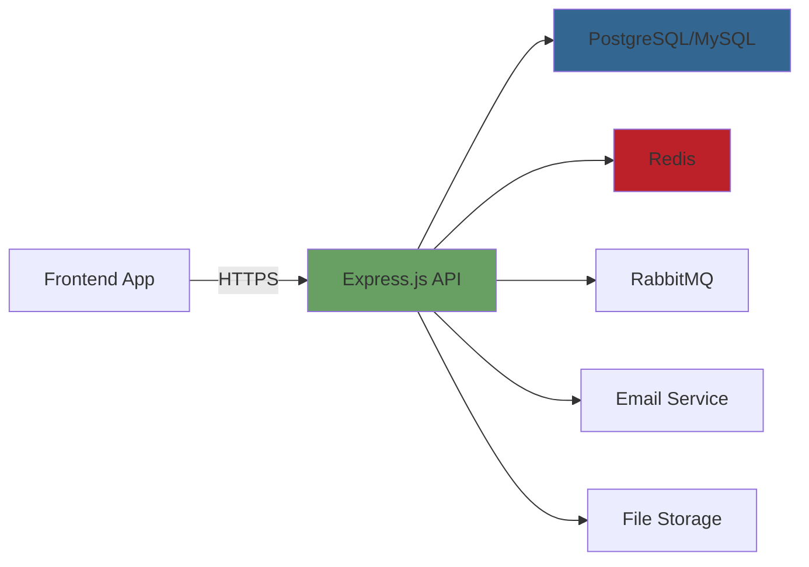

---

## 2. Architecture

### 2.1 System Architecture

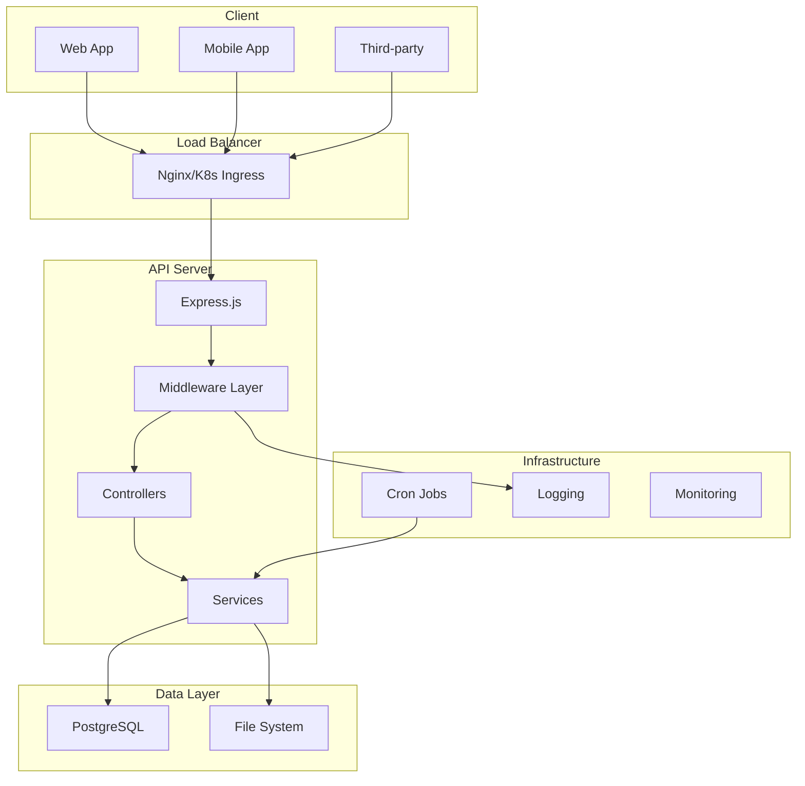

### 2.2 Application Flow

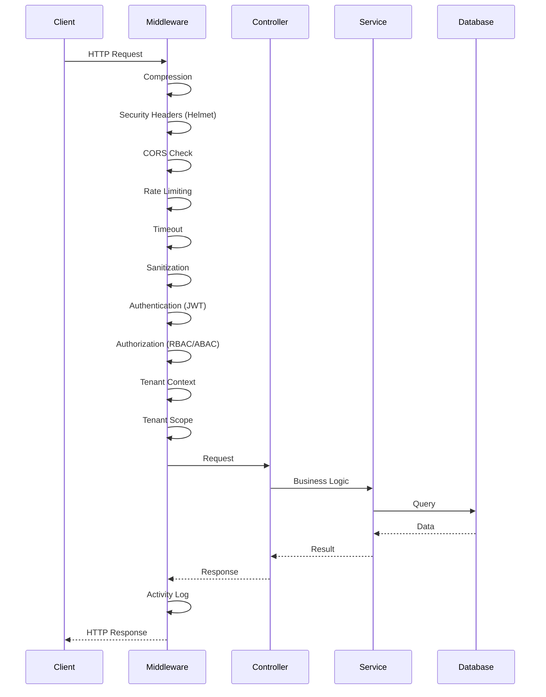

### 2.3 Project Structure

```
boilerplate-pg-mysql/
├── src/
│   ├── config/              # Database and app configuration
│   │   ├── index.js         # Sequelize setup
│   │   ├── connection.js    # Connection management
│   │   └── migrate.js       # Database migrations
│   ├── controllers/         # Request handlers
│   │   ├── auth.controller.js
│   │   ├── tenant.controller.js
│   │   ├── user.controller.js
│   │   ├── permission.controller.js
│   │   ├── tablePermission.controller.js
│   │   ├── tenantBackup.controller.js
│   │   └── migration.controller.js
│   ├── docs/                # Swagger documentation
│   │   └── swagger.js
│   ├── middlewares/         # Express middlewares
│   │   ├── auth.js          # JWT authentication
│   │   ├── rbac.js          # Role-based access control
│   │   ├── abac.js          # Attribute-based access control
│   │   ├── tenantContext.js # Tenant identification
│   │   ├── tenantScope.js   # Tenant query scoping
│   │   ├── backup.js        # Backup cron jobs
│   │   ├── sessionCleanup.js # Session cleanup
│   │   ├── activityLog.js   # Winston logging
│   │   ├── accessLog.js     # Access logging
│   │   ├── validation.js    # Input validation
│   │   └── ...
│   ├── models/              # Sequelize models
│   │   ├── user.js
│   │   ├── tenant.js
│   │   ├── permission.js
│   │   ├── roles.js
│   │   ├── session.js
│   │   └── ...
│   ├── routes/              # API route definitions
│   │   ├── api/             # Public API routes
│   │   │   ├── auth.js
│   │   │   ├── tenant.js
│   │   │   ├── user.js
│   │   │   └── permission.js
│   │   └── internal/        # Internal routes
│   │       └── migration.js
│   ├── services/            # Business logic
│   │   ├── auth.service.js
│   │   ├── tenant.service.js
│   │   ├── tenantBackup.service.js
│   │   ├── tenantFeature.service.js
│   │   └── ...
│   ├── templates/           # Email templates
│   │   ├── account.html
│   │   ├── otp.html
│   │   └── template.html
│   ├── utils/               # Utility functions
│   │   ├── jwt.js
│   │   ├── password.js
│   │   ├── session.js
│   │   └── ...
│   └── validators/          # Joi validation schemas
│       ├── auth.validator.js
│       ├── tenant.validator.js
│       └── user.validator.js
├── uploads/                 # User uploaded files
│   ├── tenant/              # Tenant logos
│   └── profile/             # User avatars
├── docker-compose.yaml      # Docker configuration
├── Dockerfile               # Docker build
├── package.json             # Dependencies
├── swagger.json             # OpenAPI spec
└── index.js                 # Entry point
```

---

## 3. Installation & Setup

### 3.1 Prerequisites

- **Node.js** 18 or higher
- **PostgreSQL** 14+ or **MySQL** 8+
- **npm** or **bun** package manager
- **Docker** and **Docker Compose** (optional)

### 3.2 Quick Start with Docker

```bash
# Clone repository
git clone https://github.com/zed378/boilerplate-pg-mysql.git
cd boilerplate-pg-mysql

# Copy environment file
cp local.env .env

# Start services
docker-compose up -d
```

### 3.3 Manual Setup

```bash
# Install dependencies
npm install

# Configure environment
cp local.env .env
# Edit .env with your settings

# Start development server
npm run dev

# Start production server
npm start
```

---

## 4. Configuration

### 4.1 Environment Variables

| Variable              | Description              | Default                  |
| --------------------- | ------------------------ | ------------------------ |
| `PORT`                | Server port              | `3000`                   |
| `SECRET`              | Application secret       | -                        |
| `NODE_ENV`            | Environment              | `development`            |
| `DB_HOST`             | Database host            | `localhost`              |
| `DB_PORT`             | Database port            | `5432`                   |
| `DB_NAME`             | Database name            | `boilerplate`            |
| `DB_USER`             | Database user            | `boilerplate`            |
| `DB_PASS`             | Database password        | `supersecret`            |
| `DB_DIALECT`          | Database type            | `postgres`               |
| `DB_SSL`              | Enable SSL               | `false`                  |
| `JWT_ACCESS_SECRET`   | JWT access token secret  | -                        |
| `JWT_ACCESS_EXPIRED`  | Access token expiry      | `10m`                    |
| `JWT_REFRESH_SECRET`  | JWT refresh token secret | -                        |
| `JWT_REFRESH_EXPIRED` | Refresh token expiry     | `7d`                     |
| `CORS_ORIGIN`         | Allowed origins          | -                        |
| `MAIL_HOST`           | Mail server host         | -                        |
| `BACKUP_SCHEDULER`    | Cron expression          | `0 0 * * *`              |
| `REDIS_URL`           | Redis connection URL     | `redis://localhost:6379` |
| `REDIS_HOST`          | Redis host               | `localhost`              |
| `REDIS_PORT`          | Redis port               | `6379`                   |

### 4.2 Redis Configuration

Redis is used for caching, distributed locking, message queuing, and rate limiting.

#### Redis Connection

```javascript
const Redis = require("ioredis");

const redis = new Redis(process.env.REDIS_URL, {
  maxRetriesPerRequest: 3,
  retryStrategy: (times) => {
    if (times > 3) return null;
    return Math.min(times * 200, 1000);
  },
  lazyConnect: true,
});
```

#### Caching Strategy

| Data Type        | Cache Key                  | TTL        | Invalidation            |
| ---------------- | -------------------------- | ---------- | ----------------------- |
| User by email    | `user:email:{email}`       | 1 hour     | On user update          |
| User by username | `user:username:{username}` | 1 hour     | On user update          |
| Tenant by ID     | `tenant:{id}`              | 10 minutes | On tenant update/delete |
| Tenant by code   | `tenant:code:{code}`       | 10 minutes | On tenant update/delete |
| Tenant settings  | `tenant:settings:{id}`     | 15 minutes | On settings update      |
| Tenant list      | `tenants:page:{page}`      | 5 minutes  | On tenant CRUD          |

#### Distributed Locks

```javascript
// Acquire lock
const lockId = await acquireLock(`register:${email}:${username}`, 10000);
if (!lockId) throw new Error("Operation in progress");

// Release lock (atomic via Lua script)
await releaseLock(`register:${email}:${username}`, lockId);
```

#### Email Queue (RabbitMQ)

```javascript
// Connect to RabbitMQ
const connection = await amqp.connect(process.env.RABBITMQ_URL);
const channel = await connection.createChannel();

// Assert queue with dead letter exchange
await channel.assertQueue("email_queue", {
  durable: true,
  arguments: {
    "x-dead-letter-exchange": "",
    "x-dead-letter-routing-key": "email_dlq",
  },
});

// Send message
channel.sendToQueue("email_queue", Buffer.stringify(jobData));

// Consume with manual acknowledgment
channel.consume("email_queue", (msg) => {
  processEmail(JSON.parse(msg.content));
  channel.ack(msg);
});
```

Queue features:

- Automatic retry with exponential backoff (3 retries max)
- Dead letter queue (DLQ) for failed messages
- Fallback to synchronous sending if RabbitMQ unavailable
- Background worker with prefetch (10 messages)
- Manual message acknowledgment

### 4.3 Database Configuration

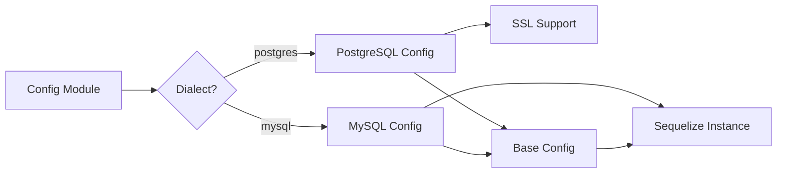

---

## 5. Database Schema

### 5.1 Entity Relationship Diagram

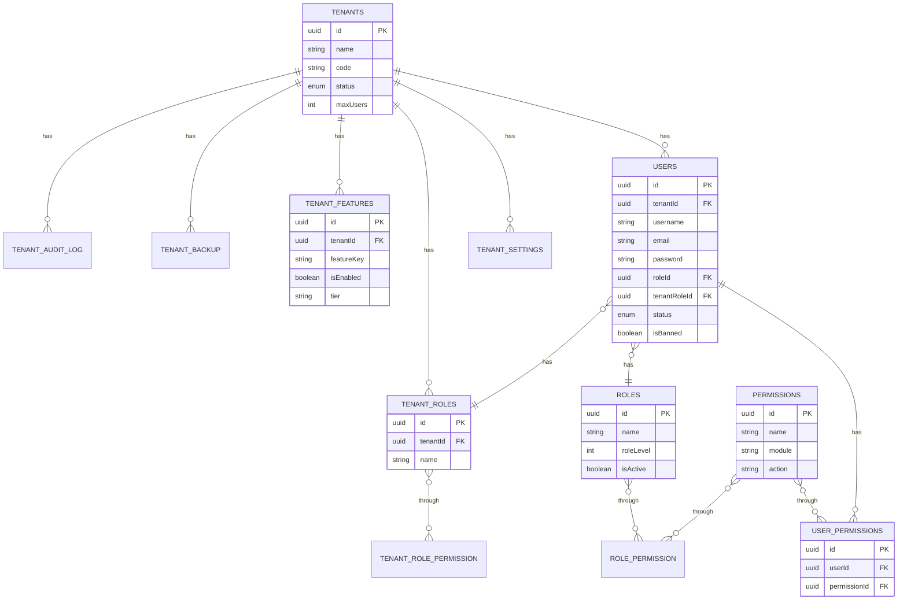

### 5.2 Model Descriptions

| Model               | Purpose                 | Key Fields                                              |
| ------------------- | ----------------------- | ------------------------------------------------------- |
| **Users**           | User accounts           | username, email, password, roleId, tenantId, status     |
| **Tenants**         | Tenant organizations    | name, code, status, maxUsers                            |
| **Permissions**     | System permissions      | name, module, action                                    |
| **Roles**           | Global roles            | name, roleLevel (1=USER, 2=TENANT_ADMIN, 3=SUPER_ADMIN) |
| **TenantRoles**     | Tenant-specific roles   | name, tenantId                                          |
| **UserPermissions** | User-permission mapping | userId, permissionId                                    |
| **TenantFeatures**  | Feature flags           | tenantId, featureKey, isEnabled, tier                   |
| **Sessions**        | User sessions           | token, userId, expiredAt                                |
| **TenantSettings**  | Tenant configurations   | tenantId, settingKey, settingValue                      |
| **TenantBackup**    | Backup records          | tenantId, backupType, status, filePath                  |
| **TenantAuditLog**  | Activity tracking       | tenantId, action, entityType, entityId                  |

---

## 6. Authentication System

### 6.1 Authentication Flow

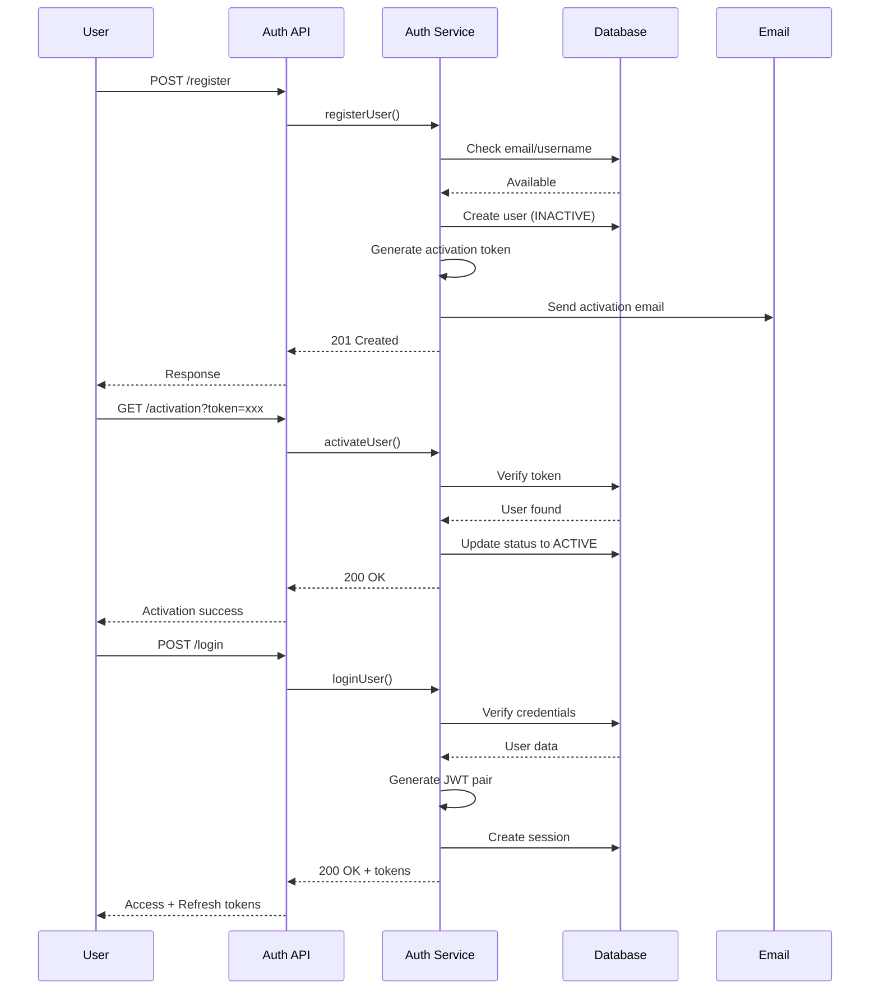

### 6.2 JWT Token Structure

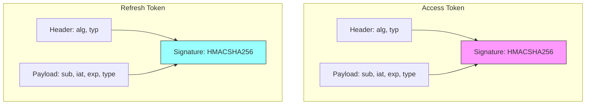

### 6.3 Authentication Middleware

The auth middleware performs these checks in order:

1. **Token Extraction** - Extract Bearer token from Authorization header
2. **JWT Verification** - Verify token signature and expiry
3. **User Fetch** - Load user with role and tenant associations
4. **Status Check** - Verify user is not banned or inactive
5. **Session Validation** - Verify session exists and is not expired
6. **Context Attachment** - Attach user, session, and tenant to request

### 6.4 Password Security

- Passwords are hashed using `bcryptjs` with configurable rounds
- OTP codes are hashed for password reset
- Password history can be tracked
- Account lockout after failed attempts

---

## 7. Authorization System

### 7.1 Role-Based Access Control (RBAC)

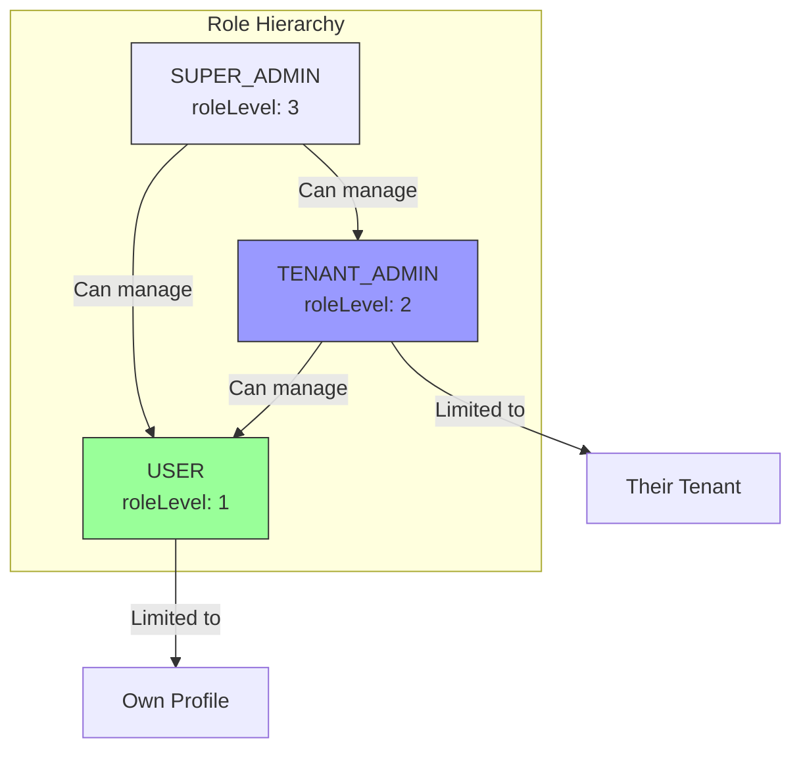

**Role Levels:**

| Role             | Level | Access                           |
| ---------------- | ----- | -------------------------------- |
| **SUPER_ADMIN**  | 3     | Full system access, all tenants  |
| **TENANT_ADMIN** | 2     | Manage users within their tenant |
| **USER**         | 1     | Manage own profile only          |

### 7.2 Attribute-Based Access Control (ABAC)

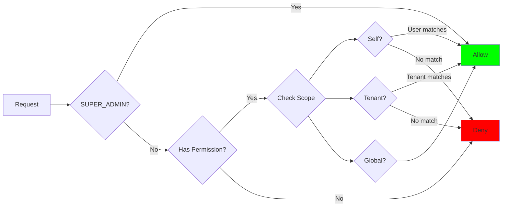

**Permission Naming Convention:**

| Type   | Format                 | Example                      |
| ------ | ---------------------- | ---------------------------- |
| Global | `module:action`        | `user:read`, `tenant:create` |
| Self   | `module:self:action`   | `user:self:update`           |
| Tenant | `module:tenant:action` | `user:tenant:create`         |

### 7.3 Dynamic Table Permissions

The newer system uses database-driven table permissions:

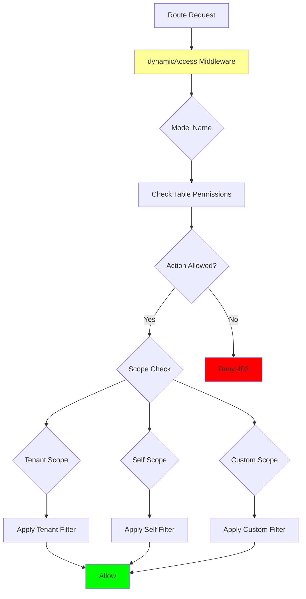

---

## 8. Multi-Tenancy

### 8.1 Tenant Identification

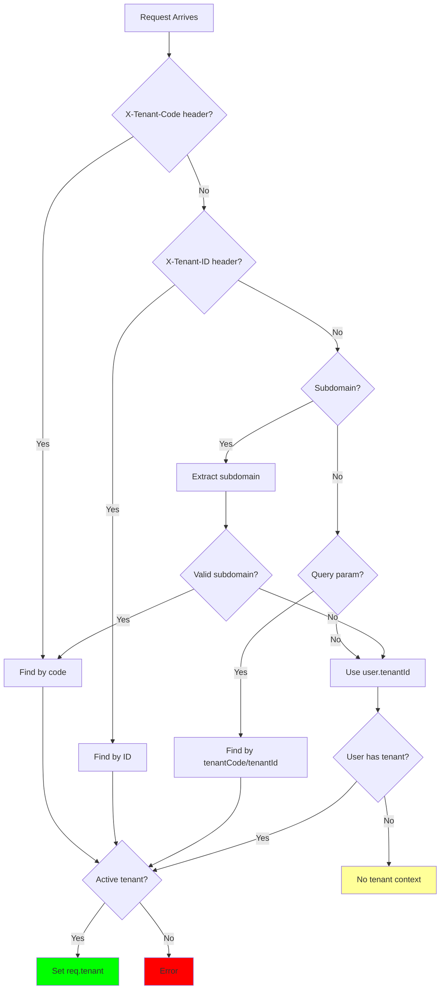

### 8.2 Tenant Scoping

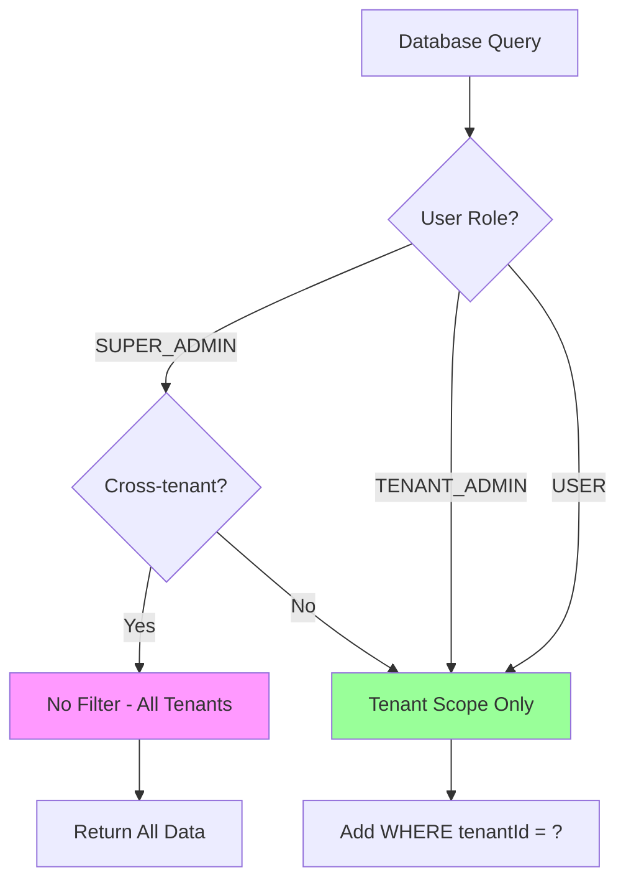

### 8.3 Feature Flags

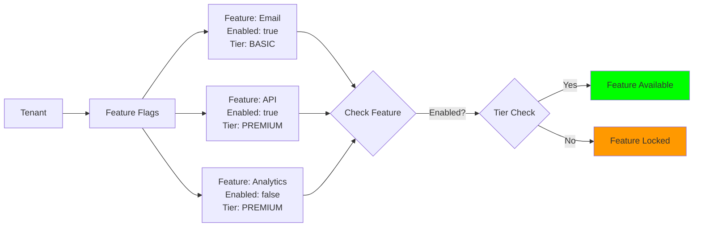

---

## 9. API Endpoints

### 9.1 Authentication Endpoints

| Method | Endpoint                      | Description        | Auth     | Rate Limit |
| ------ | ----------------------------- | ------------------ | -------- | ---------- |
| POST   | `/api/v1/auth/register`       | Register new user  | Public   | 3/hour     |
| GET    | `/api/v1/auth/activation`     | Activate account   | Public   | -          |
| POST   | `/api/v1/auth/login`          | Login              | Public   | -          |
| POST   | `/api/v1/auth/send-otp`       | Send OTP           | Public   | 10/hour    |
| POST   | `/api/v1/auth/reset-password` | Reset password     | Public   | -          |
| POST   | `/api/v1/auth/verify`         | Verify OTP         | Public   | -          |
| POST   | `/api/v1/auth/logout`         | Logout             | Required | -          |
| POST   | `/api/v1/auth/logout-all`     | Logout all devices | Required | -          |
| GET    | `/api/v1/auth/verify`         | Verify token       | Required | -          |

### 9.2 Tenant Endpoints

| Method | Endpoint                      | Description   | Auth     | Permission    |
| ------ | ----------------------------- | ------------- | -------- | ------------- |
| GET    | `/api/v1/tenants/all`         | List tenants  | Required | Tenant:read   |
| POST   | `/api/v1/tenants/detail`      | Get tenant    | Required | Tenant:read   |
| POST   | `/api/v1/tenants/create`      | Create tenant | Required | Tenant:create |
| PUT    | `/api/v1/tenants/update`      | Update tenant | Required | Tenant:update |
| DELETE | `/api/v1/tenants/delete`      | Delete tenant | Required | Tenant:delete |
| POST   | `/api/v1/tenants/upload-logo` | Upload logo   | Required | -             |

### 9.3 User Endpoints

| Method | Endpoint                      | Description   | Auth     | Permission  |
| ------ | ----------------------------- | ------------- | -------- | ----------- |
| GET    | `/api/v1/users/all`           | List users    | Required | User:read   |
| POST   | `/api/v1/users/detail`        | Get user      | Required | User:read   |
| POST   | `/api/v1/users/create`        | Create user   | Required | User:create |
| PUT    | `/api/v1/users/update`        | Update user   | Required | User:update |
| DELETE | `/api/v1/users/delete`        | Delete user   | Required | User:delete |
| POST   | `/api/v1/users/upload-avatar` | Upload avatar | Required | -           |

### 9.4 Permission Endpoints

| Method | Endpoint                     | Description       | Auth     | Role        |
| ------ | ---------------------------- | ----------------- | -------- | ----------- |
| GET    | `/api/v1/permissions/all`    | List permissions  | Required | SUPER_ADMIN |
| POST   | `/api/v1/permissions/create` | Create permission | Required | SUPER_ADMIN |
| PUT    | `/api/v1/permissions/update` | Update permission | Required | SUPER_ADMIN |
| DELETE | `/api/v1/permissions/delete` | Delete permission | Required | SUPER_ADMIN |

### 9.5 Table Permission Endpoints

| Method | Endpoint                        | Description       | Auth     |
| ------ | ------------------------------- | ----------------- | -------- |
| GET    | `/api/v1/table-permissions`     | List permissions  | Required |
| POST   | `/api/v1/table-permissions`     | Create permission | Required |
| PUT    | `/api/v1/table-permissions/:id` | Update permission | Required |
| DELETE | `/api/v1/table-permissions/:id` | Delete permission | Required |

### 9.6 Tenant Backup Endpoints

| Method | Endpoint                             | Description     | Auth     |
| ------ | ------------------------------------ | --------------- | -------- |
| POST   | `/api/v1/tenant-backup/create`       | Create backup   | Required |
| GET    | `/api/v1/tenant-backup`              | List backups    | Required |
| GET    | `/api/v1/tenant-backup/download/:id` | Download backup | Required |
| POST   | `/api/v1/tenant-backup/restore/:id`  | Restore backup  | Required |

### 9.7 Migration Endpoints (Internal)

| Method | Endpoint                   | Description    |
| ------ | -------------------------- | -------------- |
| GET    | `/api/v1/migration/up`     | Run migrations |
| GET    | `/api/v1/migration/down`   | Drop tables    |
| GET    | `/api/v1/migration/seed`   | Seed data      |
| GET    | `/api/v1/migration/unseed` | Unseed data    |

### 9.8 Swagger Documentation

Access the interactive API documentation at:

```
http://localhost:3000/docs
```

```mermaid
graph LR
    A[Client] -->|Browser| B[/docs]
    B --> C[Swagger UI]
    C --> D[swagger.json]
    D --> E[API Schema]
    C -->|Try it out| A

    style C fill:#85EA2D
```

---

## 10. Services

### 10.1 Service Architecture

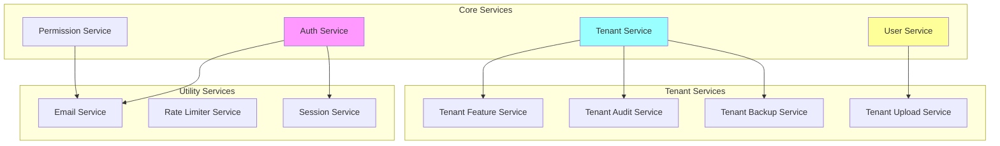

### 10.2 Key Services

**Auth Service:**

- User registration with email verification
- Login with JWT token generation
- OTP-based password reset
- Session management
- Login activity tracking

**Tenant Service:**

- CRUD operations for tenants
- Tenant search and filtering
- User count per tenant
- Logo management

**Tenant Backup Service:**

- Export tenant data to JSON
- Create ZIP backups
- Calculate checksums
- Restore from backups
- Backup history tracking

**Tenant Feature Service:**

- Enable/disable features per tenant
- Feature tier management (BASIC, PREMIUM, BETA)
- Feature expiration tracking

---

## 11. Middlewares

### 11.1 Middleware Pipeline

```mermaid
graph LR
    A[Request] --> 1[Compression]
    1 --> 2[Helmet]
    2 --> 3[HPP]
    3 --> 4[CORS]
    4 --> 5[Rate Limiter]
    5 --> 6[Timeout]
    6 --> 7[JSON Parser]
    7 --> 8[Global Sanitizer]
    8 --> 9[Auth]
    9 --> 10[RBAC]
    10 --> 11[ABAC]
    11 --> 12[Tenant Context]
    12 --> 13[Tenant Scope]
    13 --> 14[Validation]
    14 --> 15[Controller]
    15 --> B[Response]

    style 9 fill:#f9f
    style 10 fill:#9ff
    style 11 fill:#ff9
    style 12 fill:#9f9
```

### 11.2 Middleware Reference

| Middleware           | Purpose                | Key Function                         |
| -------------------- | ---------------------- | ------------------------------------ |
| **globalSanitizer**  | Sanitize input data    | Removes XSS, special characters      |
| **auth**             | JWT authentication     | Verifies token, session, user status |
| **rbac**             | Role-based access      | Checks role hierarchy                |
| **abac**             | Attribute-based access | Checks permissions, scopes           |
| **dynamicAccess**    | Dynamic permissions    | Database-driven permission checks    |
| **tenantContext**    | Tenant identification  | Identifies tenant from headers/query |
| **tenantScope**      | Query scoping          | Adds tenant filter to queries        |
| **validation**       | Input validation       | Joi schema validation                |
| **tokenRateLimiter** | Rate limiting          | Token bucket algorithm               |

---

## 12. Backup & Recovery

### 12.1 System Backup

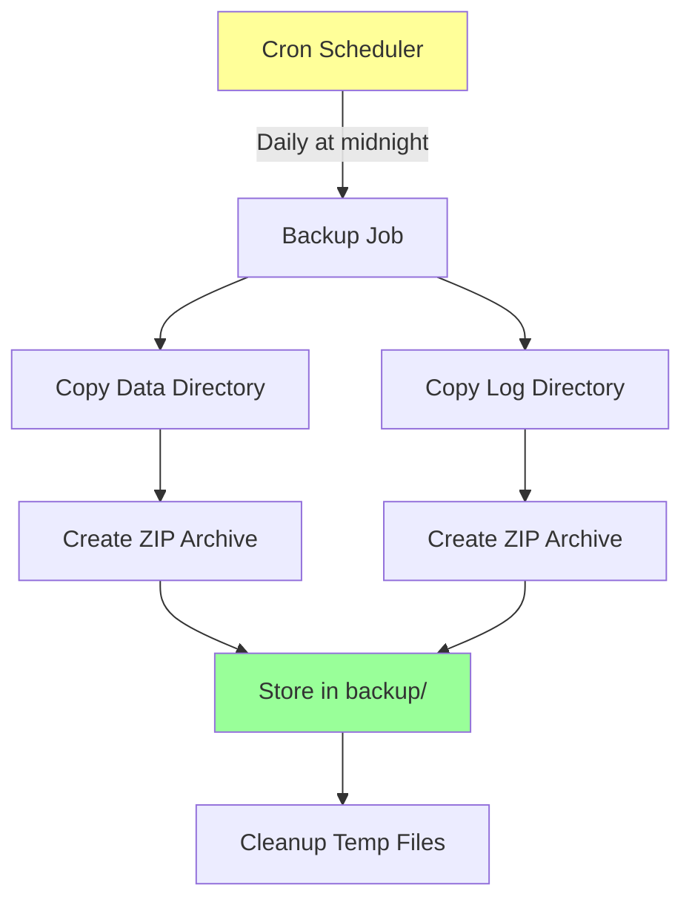

### 12.2 Tenant Backup

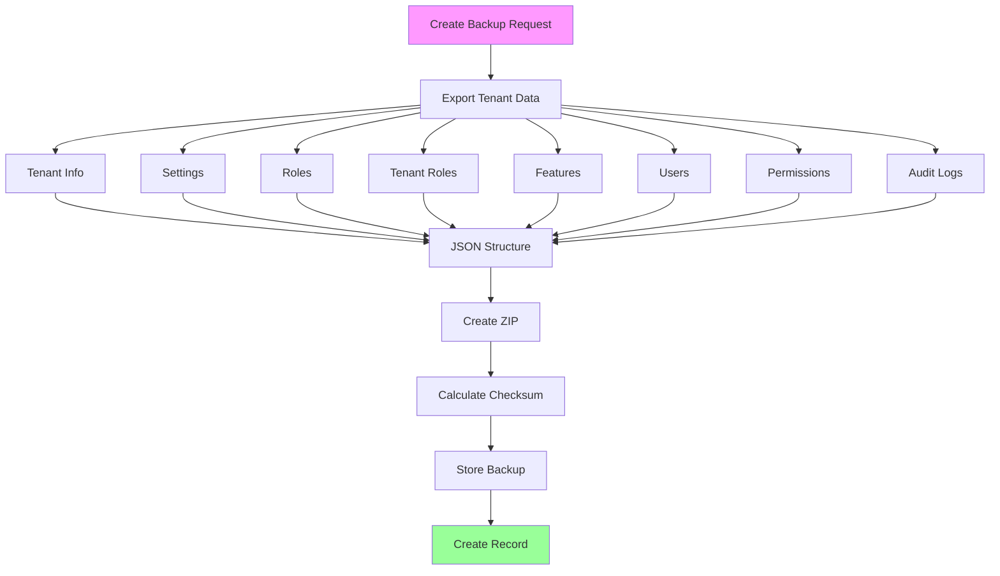

### 12.3 Backup Schedule

| Backup Type     | Schedule                     | Description                   |
| --------------- | ---------------------------- | ----------------------------- |
| System Backup   | `0 0 * * *` (daily midnight) | Zips data and log directories |
| Session Cleanup | `0 2 * * *` (daily 2 AM)     | Removes expired sessions      |

---

## 13. Logging & Monitoring

### 13.1 Logging Architecture

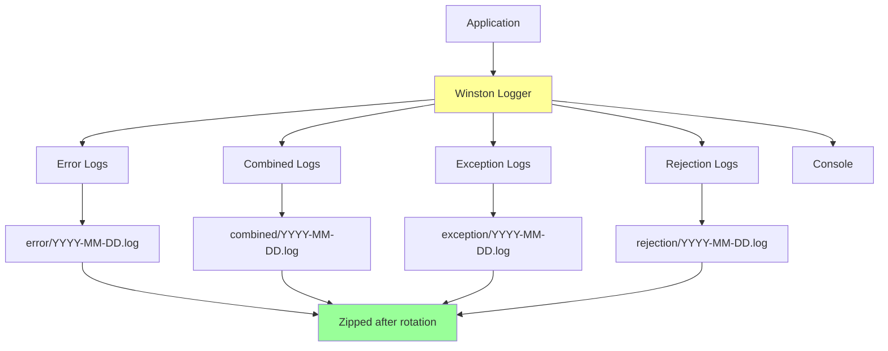

### 13.2 Log Levels

| Level     | Description        | Transport                    |
| --------- | ------------------ | ---------------------------- |
| **error** | Error conditions   | File (daily rotate, 30 days) |
| **warn**  | Warning conditions | File (daily rotate, 30 days) |
| **info**  | Informational      | File (daily rotate, 30 days) |
| **debug** | Debug information  | Console (development only)   |

### 13.3 Activity Logging

Each request generates an activity log containing:

- Request ID (UUID)
- HTTP method and URL
- Client IP address
- Response status code
- Response time (ms)
- User agent

---

## 14. Security Features

### 14.1 Security Layers

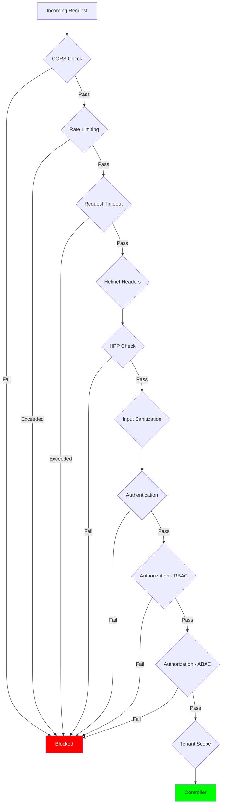

### 14.2 Security Features Summary

| Feature           | Implementation          | Purpose                      |
| ----------------- | ----------------------- | ---------------------------- |
| **Helmet**        | Security headers        | XSS, clickjacking protection |
| **CORS**          | Origin whitelist        | Cross-origin control         |
| **HPP**           | Parameter pollution     | Prevent parameter attacks    |
| **Rate Limiting** | Token bucket + IP-based | DDoS protection              |
| **JWT**           | Signed tokens           | Secure authentication        |
| **Bcrypt**        | Password hashing        | Password security            |
| **Sanitization**  | XSS filtering           | Input sanitization           |
| **Timeout**       | Request timeout         | Prevent hanging requests     |
| **Session**       | Token-based sessions    | Session management           |

---

## 15. Performance Optimization

### 15.1 Redis Integration

Redis is used for caching, distributed locking, message queuing, and rate limiting to improve application performance and prevent race conditions.

#### Architecture

```mermaid
graph LR
    A[API Request] --> B{Cache Hit?}
    B -->|Yes| C[Return Cached Data]
    B -->|No| D[Query Database]
    D --> E[Cache Result]
    E --> F[Return Data]

    G[Email Service] -->|Queue| H[(Redis Queue)]
    H -->|Worker| I[Send Email]

    J[Register Request] --> K[Distributed Lock]
    K --> L{Lock Available?}
    L -->|Yes| M[Process Request]
    L -->|No| N[Return 429]
```

#### Caching Layers

| Layer           | Key Pattern            | TTL        | Purpose                    |
| --------------- | ---------------------- | ---------- | -------------------------- |
| User Lookup     | `user:email:{email}`   | 1 hour     | Fast user identification   |
| Tenant Data     | `tenant:{id}`          | 10 minutes | Reduce database load       |
| Tenant Settings | `tenant:settings:{id}` | 15 minutes | Quick configuration access |
| Tenant List     | `tenants:page:{page}`  | 5 minutes  | Paginated list caching     |

#### Distributed Locking

Prevents race conditions during concurrent operations:

```javascript
// Registration race condition prevention
const lockKey = `register:${email}:${username}`;
const lockId = await acquireLock(lockKey, 10000);

if (!lockId) {
  throw { status: 429, message: "Registration in progress. Please wait." };
}

try {
  // Process registration
} finally {
  await releaseLock(lockKey, lockId);
}
```

#### Email Queue (RabbitMQ)

Async email processing for non-blocking responses:

```mermaid
sequenceDiagram
    participant API as API Endpoint
    participant R as RabbitMQ
    participant W as Worker
    participant E as Email Service

    API->>R: sendToQueue(email_queue)
    API-->>Client: 200 OK (immediate)
    W->>R: consume(email_queue)
    R->>W: Deliver message
    W->>E: Send email
    E-->>W: Success/Failure
    alt Failure
        W->>R: NACK + requeue (backoff)
    else Success
        W->>R: ACK
    end
    alt Max retries exceeded
        R->>R: Route to DLQ (email_dlq)
    end
```

| Feature           | Description                                 |
| ----------------- | ------------------------------------------- |
| Retry Policy      | Exponential backoff (2^retries \* 1000ms)   |
| Max Retries       | 3 attempts                                  |
| Dead Letter Queue | Failed messages routed to email_dlq         |
| Prefetch          | 10 messages per worker                      |
| Fallback          | Synchronous sending if RabbitMQ unavailable |
| Acknowledgment    | Manual ACK/NACK                             |

### 15.2 Database Optimizations

#### Row-Level Locking

```javascript
// Prevent concurrent duplicate checks
const user = await Users.findOne({
  where: { email },
  transaction,
  lock: transaction.LOCK.UPDATE,
});
```

This generates `SELECT ... FOR UPDATE` to lock rows during transactions.

#### Rate Limiting

Redis-based rate limiting for OTP requests:

```javascript
const rateLimitKey = `otp:rate:${email}`;
const count = await get(rateLimitKey);

if (count >= 3) {
  throw { status: 429, message: "Too many OTP requests" };
}
```

---

## 16. Testing

### 15.1 Test Structure

```
src/tests/
├── services/
│   ├── sessionCleanup.test.js
│   ├── tenantAudit.service.test.js
│   ├── tenantBackup.service.test.js
│   ├── tenantContext.test.js
│   ├── tenantFeature.service.test.js
│   ├── tenantOnboarding.service.test.js
│   └── tenantScope.test.js
├── utils/
│   ├── appError.test.js
│   ├── controllerWrapper.test.js
│   ├── response.test.js
│   └── upload.test.js
└── validators/
    ├── auth.validator.test.js
    ├── tenant.validator.test.js
    └── user.validator.test.js
```

### 15.2 Running Tests

```bash
# Run all tests
npm test

# Run tests in watch mode
npm run test:watch

# Generate coverage report
npm run test:coverage
```

---

## 16. Deployment

### 16.1 Docker Deployment

```yaml
# docker-compose.yaml
services:
  backend:
    build: .
    container_name: backend
    restart: always
    ports:
      - "3000:3000"
    env_file:
      - .env
    depends_on:
      - postgres
      - redis

  redis:
    image: redis:7-alpine
    container_name: redis
    restart: always
    ports:
      - "6379:6379"
    volumes:
      - ./data/redis:/data

  postgres:
    image: postgres:17-alpine
    container_name: postgres
    restart: always
    env_file:
      - .env
    ports:
      - "5432:5432"
    volumes:
      - ./data/postgres:/var/lib/postgresql/data

  pgadmin:
    image: dpage/pgadmin4:latest
    container_name: pgadmin
    ports:
      - "8888:80"
    depends_on:
      - postgres
```

**Services:**

| Service  | Image              | Port  | Purpose               |
| -------- | ------------------ | ----- | --------------------- |
| backend  | Custom             | 3000  | Express.js API server |
| redis    | redis:8.6-alpine   | 6379  | Caching, locks        |
| rabbitmq | rabbitmq:3.13-mgmt | 5672  | Message queue         |
| rabbitmq |                    | 15672 | Management UI         |
| postgres | postgres:17-alpine | 5432  | Database              |
| pgadmin  | dpage/pgadmin4     | 8888  | Database admin        |

### 16.2 Build for Production

```bash
# Build standalone binary
npm run build

# Generate Swagger docs
npm run swagger:generate
```

### 16.3 Deployment Checklist

- [ ] Set `NODE_ENV=production`
- [ ] Update all secrets in environment variables
- [ ] Configure production database
- [ ] Configure Redis (host, port, URL)
- [ ] Set up SSL/TLS
- [ ] Configure CORS origins
- [ ] Set up log rotation
- [ ] Configure backup schedule
- [ ] Set up monitoring
- [ ] Run database migrations
- [ ] Verify Redis connection
- [ ] Verify RabbitMQ connection
- [ ] Test email queue processing
- [ ] Seed initial data

---

## 18. Coding Standards

For detailed coding standards, naming conventions, and best practices, see [`CODING_STANDARDS.md`](CODING_STANDARDS.md).

### Key Standards Summary

#### Naming Conventions

| Element          | Convention                | Example                     |
| ---------------- | ------------------------- | --------------------------- |
| Service files    | `camelCase.service.js`    | `auth.service.js`           |
| Controller files | `camelCase.controller.js` | `auth.controller.js`        |
| Route files      | `camelCase.js`            | `auth.js`                   |
| Validator files  | `camelCase.validator.js`  | `auth.validator.js`         |
| Model files      | `snake_case.js`           | `login_record.js`           |
| Constants        | `UPPER_SNAKE_CASE`        | `DEFAULT_PAGE`, `MAX_LIMIT` |
| Functions        | `camelCase`               | `registerUser`, `loginUser` |
| Variables        | `camelCase`               | `existingUser`, `lockId`    |

#### Permission Format

```
module:action          -> user:create, tenant:read
module:self:action     -> user:self:update
module:tenant:action   -> user:tenant:assign
```

#### Response Format

```json
{
  "success": true,
  "status": 200,
  "message": "Operation successful",
  "data": { ... }
}
```

#### Service Pattern

- Use transactions with try/catch/rollback
- Throw errors: `{ status: code, message: "text" }`
- Return: `{ success, status, message, data }`
- Use Redis caching with `get()`, `set()`, `del()`
- Use distributed locks with `acquireLock()`, `releaseLock()`
- Queue emails with `queueActivationEmail()`, `queueOtpEmail()`

#### Documentation Generation

```bash
# Generate SVG illustrations
node scripts/generate-mermaid-svg.js

# Generate HTML documentation
node scripts/generate-html-doc.js
```

Generate docs after:

- API endpoint changes
- Database schema changes
- Environment variable changes
- Docker service changes
- Dependency changes

---

## Appendix

### A. Role IDs

| Role         | ID                                     |
| ------------ | -------------------------------------- |
| SUPER_ADMIN  | `9be20605-cc6a-4d91-8246-9756b4a1754b` |
| TENANT_ADMIN | `a1b2c3d4-e5f6-4a7b-8c9d-0e1f2a3b4c5d` |
| USER         | `f6e5d4c3-b2a1-4987-6543-210fedcba987` |

### B. Error Response Format

```json
{
  "success": false,
  "status": "Error",
  "message": "Error description",
  "errors": []
}
```

### C. Success Response Format

```json
{
  "success": true,
  "status": "Success",
  "message": "Operation successful",
  "data": {}
}
```

### D. HTTP Status Codes

| Code | Meaning               |
| ---- | --------------------- |
| 200  | Success               |
| 201  | Created               |
| 400  | Bad Request           |
| 401  | Unauthorized          |
| 403  | Forbidden             |
| 404  | Not Found             |
| 409  | Conflict              |
| 429  | Too Many Requests     |
| 500  | Internal Server Error |
