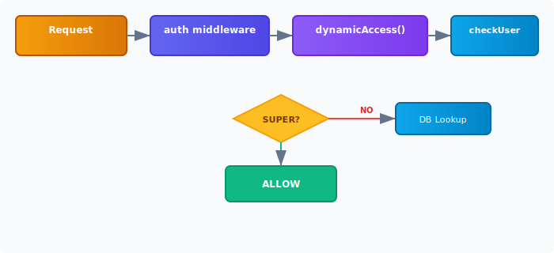
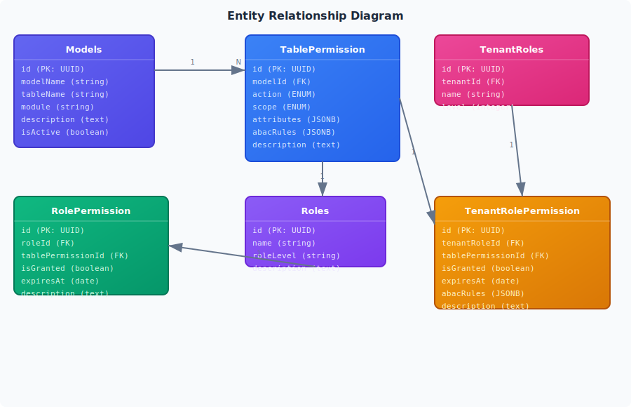

# Table Permissions System Documentation

## Table of Contents

1. [Overview](#overview)
2. [Architecture](#architecture)
3. [Terminology](#terminology)
4. [Data Model](#data-model)
5. [Permission Scopes](#permission-scopes)
6. [ABAC Rules](#abac-rules)
7. [API Endpoints](#api-endpoints)
8. [Usage Guide](#usage-guide)
9. [Implementation Guide](#implementation-guide)
10. [Middleware Usage](#middleware-usage)

---

## Overview

The Table Permissions system is a **dynamic RBAC/ABAC (Role-Based + Attribute-Based Access Control)** framework that allows fine-grained permission management at the table/model and action level. Unlike traditional static permission systems, permissions are stored in the database and can be modified at runtime without code changes.

### Key Features

- **Model-based permissions**: Each database model (table) can have independent permissions
- **Action-level control**: Granular control over create, read, update, delete, export, import actions
- **Scope-based access**: Global, tenant-scoped, self-only, or custom ABAC rules
- **Column-level permissions**: Hide or restrict specific columns/attributes
- **Role assignment**: Assign permissions to global roles or tenant-specific roles
- **Temporary permissions**: Time-limited permissions with expiration dates
- **Multi-tenancy**: Full tenant isolation with per-tenant permission overrides

---

## Architecture

<div class="diagram">
  
</div>

### Flow Diagram

<div class="diagram">
  
</div>

---

## Terminology

| Term                     | Definition                                                   | Example                                                  |
| ------------------------ | ------------------------------------------------------------ | -------------------------------------------------------- |
| **Model**                | A database table/entity that can have permissions            | `User`, `Invoice`, `Device`                              |
| **TablePermission**      | A permission entry defining who can do what on a model       | `User:read`, `Invoice:write`                             |
| **Action**               | The operation allowed on a model                             | `create`, `read`, `update`, `delete`, `export`, `import` |
| **Scope**                | The access level/boundary for a permission                   | `global`, `tenant`, `self`, `custom`                     |
| **Role**                 | A named set of permissions (global)                          | `SUPER_ADMIN`, `TENANT_ADMIN`, `USER`                    |
| **TenantRole**           | A named set of permissions scoped to a tenant                | `admin`, `manager`, `staff`                              |
| **ABAC Rules**           | Attribute-Based Access Control rules for dynamic conditions  | Owner check, attribute comparison                        |
| **Attributes**           | Column-level permissions (which fields are visible/editable) | `allowed: ['name', 'email']`                             |
| **RolePermission**       | Junction table linking Roles to TablePermissions             | Links SUPER_ADMIN → User:read                            |
| **TenantRolePermission** | Junction table linking TenantRoles to TablePermissions       | Links tenant admin → Device:export                       |

---

## Data Model

### Entity Relationship Diagram

<div class="diagram">
  
</div>

### Model: `Models`

Defines all application models (tables) that can have permissions.

```javascript
{
  id: "uuid",
  modelName: "User",           // Class name
  tableName: "users",          // Database table name
  module: "user",              // Logical grouping
  description: "User management",
  isActive: true
}
```

### Model: `TablePermission`

Defines permissions for specific actions on models.

```javascript
{
  id: "uuid",
  modelId: "uuid",             // FK to Models
  action: "read",              // create | read | update | delete | export | import
  scope: "tenant",             // global | tenant | self | custom
  attributes: {               // Column-level permissions
    allowed: ["id", "name", "email"],
    hidden: ["password", "ssn"],
    editable: ["name", "email"]
  },
  abacRules: null,            // ABAC configuration
  description: "Allow reading user records"
}
```

### Model: `RolePermission`

Links global roles to table permissions.

```javascript
{
  id: "uuid",
  roleId: "uuid",                    // FK to Roles
  tablePermissionId: "uuid",        // FK to TablePermission
  isGranted: true,
  expiresAt: null,                  // Optional expiration
  description: "Admin can read users"
}
```

### Model: `TenantRolePermission`

Links tenant roles to table permissions (with ABAC support).

```javascript
{
  id: "uuid",
  tenantRoleId: "uuid",
  tablePermissionId: "uuid",
  isGranted: true,
  expiresAt: null,
  abacRules: {                      // Optional ABAC rules
    condition: "owner",
    fields: ["userId"],
    operator: "eq"
  },
  description: "Tenant staff can only own records"
}
```

---

## Permission Scopes

### `global`

Accessible by anyone with the role, no restrictions.

```javascript
{
  action: "read",
  scope: "global",
  attributes: { allowed: ["id", "name", "email"] }
}
```

### `tenant`

Restricted to the user's tenant only.

```javascript
{
  action: "read",
  scope: "tenant",
  attributes: {}
}
```

### `self`

User can only access their own records.

```javascript
{
  action: "update",
  scope: "self",
  attributes: { editable: ["name", "email"] }
}
```

### `custom`

Custom ABAC rules apply.

```javascript
{
  action: "read",
  scope: "custom",
  abacRules: {
    condition: "attribute",
    fields: ["status"],
    operator: "in",
    value: ["active", "pending"]
  }
}
```

---

## ABAC Rules

ABAC (Attribute-Based Access Control) rules enable dynamic, condition-based access control.

### Condition Types

| Condition   | Description                            | Required Fields               |
| ----------- | -------------------------------------- | ----------------------------- |
| `owner`     | User can only access their own records | `fields: ["userId"]`          |
| `attribute` | Check resource attribute against value | `fields`, `operator`, `value` |
| `custom`    | Custom JavaScript expression           | `expression`                  |
| `tenant`    | User must be in the same tenant        | -                             |

### ABAC Rule Examples

#### Owner Rule

```json
{
  "condition": "owner",
  "fields": ["userId"],
  "operator": "eq"
}
```

User can only access records where `userId === currentUser.id`.

#### Attribute Rule

```json
{
  "condition": "attribute",
  "fields": ["status"],
  "operator": "in",
  "value": ["active", "pending"]
}
```

User can only access records where `status` is in `["active", "pending"]`.

#### Custom Expression Rule

```json
{
  "condition": "custom",
  "expression": "record.departmentId === user.departmentId",
  "fields": ["departmentId"]
}
```

User can only access records in their department.

### Supported Operators

| Operator     | Description      | Example                           |
| ------------ | ---------------- | --------------------------------- |
| `eq` / `==`  | Equal            | `status === "active"`             |
| `neq` / `!=` | Not equal        | `status !== "deleted"`            |
| `in`         | In array         | `status in ["active", "pending"]` |
| `nin`        | Not in array     | `status nin ["deleted"]`          |
| `gt`         | Greater than     | `amount > 1000`                   |
| `lt`         | Less than        | `amount < 10000`                  |
| `gte`        | Greater or equal | `level >= 3`                      |
| `lte`        | Less or equal    | `level <= 5`                      |

---

## API Endpoints

Base path: `/api/v1/table-permissions`

### Models Management

| Method | Endpoint         | Description                            | Auth Required |
| ------ | ---------------- | -------------------------------------- | ------------- |
| GET    | `/models`        | Get all models (paginated, searchable) | Yes           |
| POST   | `/models`        | Create a new model                     | Yes           |
| POST   | `/models/detail` | Get model detail by ID                 | Yes           |
| PATCH  | `/models`        | Update a model                         | Yes           |
| DELETE | `/models?id=xxx` | Delete a model                         | Yes           |

### Table Permissions Management

| Method | Endpoint              | Description                           | Auth Required |
| ------ | --------------------- | ------------------------------------- | ------------- |
| POST   | `/permissions/detail` | Get permissions for a model           | Yes           |
| POST   | `/permissions/upsert` | Create/update permissions for a model | Yes           |
| PATCH  | `/permissions`        | Update a specific permission          | Yes           |
| DELETE | `/permissions?id=xxx` | Delete a permission                   | Yes           |

### Role Permissions Management

| Method | Endpoint                        | Description                        | Auth Required |
| ------ | ------------------------------- | ---------------------------------- | ------------- |
| POST   | `/role-permissions/grant`       | Grant permission to global role    | Yes           |
| POST   | `/role-permissions/revoke`      | Revoke permission from global role | Yes           |
| POST   | `/role-permissions`             | Get all permissions for a role     | Yes           |
| POST   | `/role-permissions/bulk-assign` | Bulk assign permissions to role    | Yes           |

### Tenant Role Permissions Management

| Method | Endpoint                               | Description                            | Auth Required |
| ------ | -------------------------------------- | -------------------------------------- | ------------- |
| POST   | `/tenant-role-permissions/grant`       | Grant permission to tenant role        | Yes           |
| POST   | `/tenant-role-permissions/revoke`      | Revoke permission from tenant role     | Yes           |
| POST   | `/tenant-role-permissions`             | Get all permissions for a tenant role  | Yes           |
| PATCH  | `/tenant-role-permissions/abac-rules`  | Update ABAC rules for tenant role      | Yes           |
| POST   | `/tenant-role-permissions/bulk-assign` | Bulk assign permissions to tenant role | Yes           |

### Permission Checking

| Method | Endpoint              | Description                     | Auth Required |
| ------ | --------------------- | ------------------------------- | ------------- |
| POST   | `/check`              | Check if user has permission    | Yes           |
| POST   | `/allowed-attributes` | Get allowed attributes for user | Yes           |

---

## Usage Guide

### Step 1: Register a Model

First, register the model in the system:

```javascript
// POST /api/v1/table-permissions/models
{
  "modelName": "Device",
  "tableName": "devices",
  "module": "device",
  "description": "Hospital device management"
}
```

### Step 2: Define Table Permissions

Create permissions for each action:

```javascript
// POST /api/v1/table-permissions/permissions/upsert
{
  "modelId": "<model-uuid>",
  "permissions": [
    {
      "action": "create",
      "scope": "global",
      "attributes": {},
      "description": "Anyone can create devices"
    },
    {
      "action": "read",
      "scope": "tenant",
      "attributes": {
        "allowed": ["id", "name", "type", "status", "location"],
        "hidden": ["internalNotes"]
      },
      "description": "Tenant users can read devices in their tenant"
    },
    {
      "action": "update",
      "scope": "self",
      "attributes": {
        "editable": ["status", "location"]
      },
      "description": "Users can only update their own devices"
    },
    {
      "action": "delete",
      "scope": "custom",
      "abacRules": {
        "condition": "attribute",
        "fields": ["status"],
        "operator": "eq",
        "value": "retired"
      },
      "description": "Can only delete retired devices"
    },
    {
      "action": "export",
      "scope": "global",
      "description": "Allow exporting device data"
    },
    {
      "action": "import",
      "scope": "global",
      "description": "Allow importing device data"
    }
  ]
}
```

### Step 3: Assign Permissions to Roles

```javascript
// First, get the table permission IDs from the response of step 2

// POST /api/v1/table-permissions/role-permissions/grant
{
  "roleId": "<super-admin-role-uuid>",
  "tablePermissionId": "<device-read-permission-uuid>",
  "description": "SUPER_ADMIN can read all devices"
}

// POST /api/v1/table-permissions/role-permissions/grant
{
  "roleId": "<user-role-uuid>",
  "tablePermissionId": "<device-read-permission-uuid>",
  "description": "Regular users can read devices"
}
```

### Step 4: Assign Permissions to Tenant Roles (with ABAC)

```javascript
// POST /api/v1/table-permissions/tenant-role-permissions/grant
{
  "tenantRoleId": "<tenant-admin-role-uuid>",
  "tablePermissionId": "<device-update-permission-uuid>",
  "abacRules": {
    "condition": "owner"
  },
  "description": "Tenant admin can update devices they own"
}
```

---

## Implementation Guide

### Adding Table Permissions to a New Module

#### 1. Seed the Model

Create a seed entry in `utils/seedTablePermissions.js`:

```javascript
{
  modelName: "Device",
  tableName: "devices",
  module: "device",
  description: "Hospital device management",
  isActive: true
}
```

#### 2. Define Default Permissions

```javascript
{
  modelName: "Device",
  permissions: [
    { action: "create", scope: "global" },
    { action: "read", scope: "tenant" },
    { action: "update", scope: "self" },
    { action: "delete", scope: "global" },
    { action: "export", scope: "global" },
    { action: "import", scope: "global" }
  ]
}
```

#### 3. Use Dynamic Access Middleware

In your route file:

```javascript
const express = require("express");
const router = express.Router();
const { auth } = require("../../middlewares/auth");
const { dynamicAccess } = require("../../middlewares/dynamicAccess");
const controller = require("../../controllers/device.controller");

// GET /api/v1/devices - Read devices (tenant-scoped)
router.get(
  "/",
  auth,
  dynamicAccess("Device", "read", { checkTenant: true }),
  controller.getAll,
);

// POST /api/v1/devices/create - Create device
router.post(
  "/create",
  auth,
  dynamicAccess("Device", "create"),
  controller.create,
);

// PATCH /api/v1/devices/edit - Update device (self-only)
router.patch(
  "/edit",
  auth,
  dynamicAccess("Device", "update", { checkSelf: true }),
  controller.update,
);

// DELETE /api/v1/devices/delete - Delete device
router.delete(
  "/delete",
  auth,
  dynamicAccess("Device", "delete"),
  controller.delete,
);

// GET /api/v1/devices/export - Export devices
router.get(
  "/export",
  auth,
  dynamicAccess("Device", "export"),
  controller.export,
);

module.exports = router;
```

#### 4. Apply Column Filtering in Controllers

```javascript
// GET /api/v1/devices
exports.getAll = async (req, res, next) => {
  try {
    const { page = 1, limit = 20 } = req.query;

    // Get allowed attributes from request context
    const allowedAttrs = req.allowedAttributes?.allowed || [
      "id",
      "name",
      "type",
      "status",
    ];

    const devices = await Device.findAll({
      attributes: allowedAttrs,
      where: { tenantId: req.user.tenantId },
      limit: Number(limit),
      offset: (Number(page) - 1) * limit,
    });

    // Response helper
    success(res, devices, null, "Devices fetched successfully", 200);
  } catch (error) {
    next(error);
  }
};
```

---

## Middleware Usage

### dynamicAccess Middleware

The primary middleware for checking table permissions.

```javascript
const { dynamicAccess } = require("./middlewares/dynamicAccess");

// Simple check
router.get(
  "/",
  auth,
  dynamicAccess("Invoice", "read", { checkTenant: true }),
  controller,
);

// Self-check (user can only access their own record)
router.patch(
  "/:id",
  auth,
  dynamicAccess("User", "update", { checkSelf: true }),
  controller,
);

// Multiple actions (OR - user needs any one)
router.get("/", auth, dynamicAccess("Product", ["read", "export"]), controller);

// Multiple actions (AND - user needs all)
router.post(
  "/bulk",
  auth,
  dynamicAccess("Report", ["read", "export"], { requireAll: true }),
  controller,
);

// Custom ID field
router.get(
  "/:userId",
  auth,
  dynamicAccess("UserProfile", "read", { idField: "userId" }),
  controller,
);
```

### ABAC Middleware

For legacy permission-based checks:

```javascript
const { abac } = require("./middlewares/abac");

router.post(
  "/create",
  auth,
  abac(["user:create", "user:tenant:create"], { checkTenant: true }),
  controller,
);
router.patch(
  "/:id",
  auth,
  abac(["user:update"], { checkSelf: true }),
  controller,
);
```

### hasDynamicPermission

For checking permissions without blocking access (useful for UI rendering):

```javascript
router.post("/check", auth, controller.hasDynamicPermission);

// Request body:
{ "modelName": "Device", "action": "read" }

// Response:
{
  "success": true,
  "data": {
    "allowed": true,
    "permission": { scope: "tenant", attributes: { allowed: [...] } },
    "abacRules": null
  }
}
```

---

## Super Admin Bypass

Users with the `SUPER_ADMIN` role automatically bypass all permission checks and have access to everything. This is checked first in both `dynamicAccess` middleware and `checkUserPermission` service.

```javascript
if (user.role?.name === "SUPER_ADMIN") {
  return { allowed: true, permission: { scope: "global" }, abacRules: null };
}
```

---

## Best Practices

1. **Always register models first**: Before defining permissions, ensure the model is registered in the `Models` table.

2. **Use scoping appropriately**:
   - `global` for system-wide access
   - `tenant` for tenant-isolated resources
   - `self` for user-owned records
   - `custom` for complex ABAC conditions

3. **Define column-level permissions**: Always specify `allowed` and `hidden` attributes to prevent data leakage.

4. **Use ABAC rules for dynamic conditions**: Don't hardcode business rules; use ABAC for runtime evaluation.

5. **Set expiration for temporary access**: Use `expiresAt` for time-limited permissions (e.g., audit access).

6. **Document permission assignments**: Always provide descriptions when granting permissions.

7. **Prefer AND logic for sensitive operations**: Use `requireAll: true` when multiple permissions are required.

8. **Audit permission changes**: Track who changed what permissions and when.
